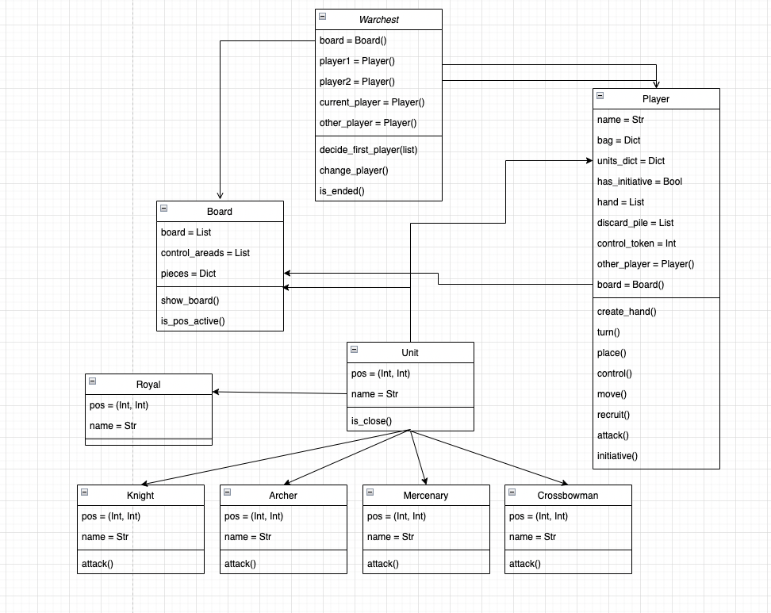

# Warchest Eventbrite Homework

This is my proposal for the warchest assignment after applying to the Software Engineer I position.

First of all I want to thank you for the opportunity to realize this assignment, I have enjoyed the process of coding object oriented code again.

And I hope I have the opportunity to answer all the questions you may have in an interview.

Hope you enjoy the game! 🚀

## Language Decision

Related to the language decision I have decided to go with **Python**, this is because Python is my main language and the one that I have worked the most. On top of that I really think that Python has a good and clear structure to work with classes and their methods.

## Code Structure

The code structure it's quite simple in this case, there is a `code/` folder  where all code is kept, inside there we have all the different built classes inside their own file. I created a total of 10 classes, `Warchest`, `Board`, `Player` and `Unit`, inside this last one I created a class for each different unit type.

There is a functions folder too, which path is `code/functions`, there we can find external function I've used to simplify the code and to be easier to read it.

And last but not least we have the tests folder, inside the `code/test` folder, here we can see a test file for each main class created.

All the code is executed from the `main.py` file in the main folder.

## Class structure

For the easy understandment of the class structure I have done a class diagram showed here below:



The game starts once you create a warchest method, the turns are handled by this class and every move from the players are handled by each player class.

## How to run the game

As said before the `main.py` file in the main folder contains all the needed code in order to start the game. So simply by running the following command you will be able to play.

```shell
python main.py
```

## How to run the tests

If you want to execute all the tests at once you can do it by running the following command:

```shell
python -m unittest discover code.test
```
